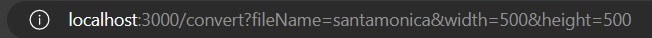
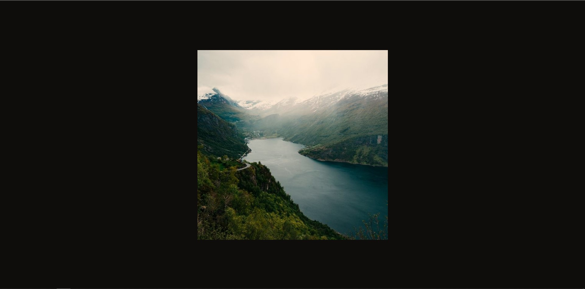

# Image-Processing-API
>## _Project one of my Udacity nanodegree_

## **1. Setup and configuration**
To use this API, first check the `package.json` file for the **dependencies** and **devDependencies** used.

Then install them accordingly as follows.
```bash
npm i <module-name> //for dependencies
npm i --save-dev <module-name> //for devDependencies
```
Configure the `tsconfig.json`, `eslint.json` files by running the following command respectively.
```bash
npx tsc --init
```
```bash
npm init @eslint/config
```
Configure those files accordingly and proceed.

Once installed, copy the `.env.example` to a new file that you'll create named `.env`
```bash
cp .env.example .env
```

>Then configure the variables within to match your preferences
## **2. Testing**
Once you're done with that, run the predefined tests using the command below, to check if the API works.
```bash
npm run test
```
## **3. Running the application**
When all tests pass, run either of these commands to start the application.
```bash
npm run start
OR
node build/.
```

This will log a message to the terminal that the server has started.
```bash
Server started at http://localhost:3000
```

Open your browser to that address, and you'll be greeted with a welcome message.

Edit the URL, using the format below.

> http://localhost:3000?/fileName=name_of_image_in_assets&width=sample_width&height=sample_height



Using the exact same url above, you'll later on see an image similar to this one below.


Try it out with different widths and heights and enjoy the process 😊.

## **Have fun!**